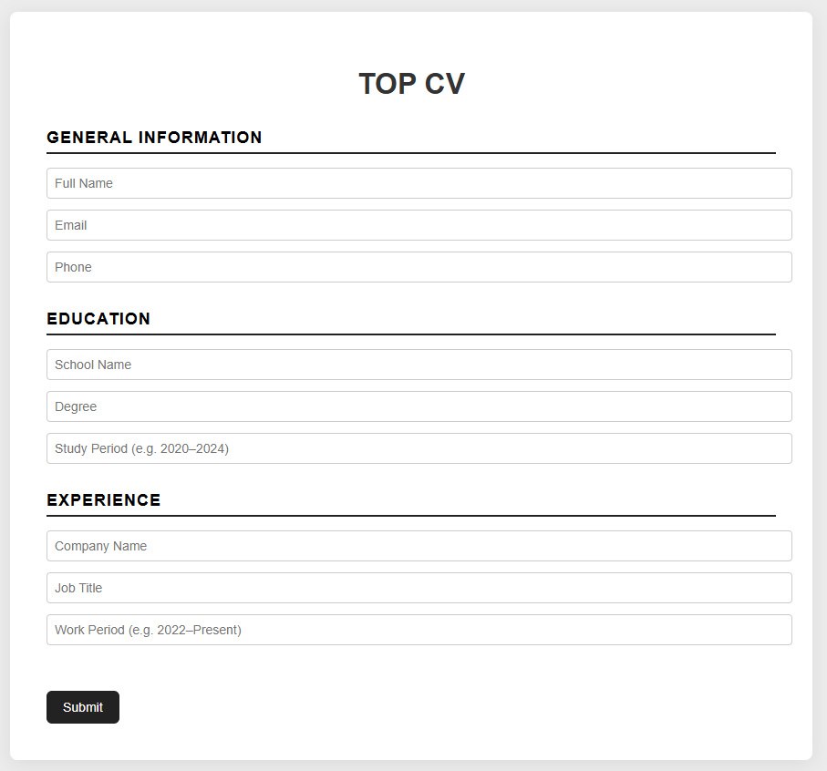
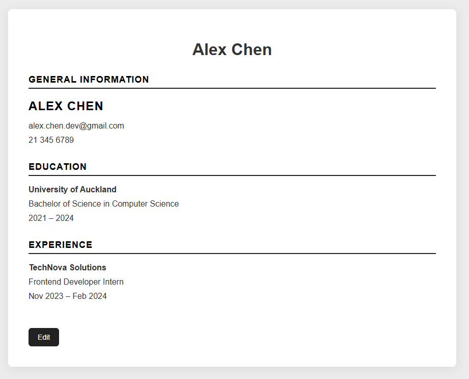

# CV Builder

This is a personal project built to create a **CV / Resume Builder application** using React.
The goal was to practice **React components, state management, controlled inputs, and conditional rendering** while building an app that allows users to enter their information and generate a formatted CV.

---

## Live Demo

Try the project live here:
[CV Builder Demo](https://top-cv-cyan.vercel.app)

---

## Screenshots

### CV Editor



### Generated CV



---

## Features

* **Single Edit / Submit toggle** to switch between editing and previewing the CV.
* **General Information section** for name, email, and phone.
* **Education section** for school, degree, and study dates.
* **Experience section** for company, role, and work period.
* **Controlled form inputs** managed with React state.
* **Conditional rendering** to switch between editable fields and formatted CV display.
* Clean and minimal **CV-style layout**.
* Built with **React functional components and hooks**.

---

## Project Structure

* `index.html` – main HTML container.
* `main.jsx` – application entry point.
* `App.jsx` – main component that stores global state and manages edit/submit mode.
* `components/`

    * `General.jsx` – handles personal information inputs and display.
    * `Education.jsx` – handles education details.
    * `Experience.jsx` – handles work experience details.
* `App.css` – styling for layout and CV formatting.

> Note: The application was built primarily to practice **React fundamentals**, including component structure, state lifting, and controlled inputs.

---

## Usage

1. Clone the repository:

```bash
git clone https://github.com/Jeraych/TOP-CV
cd TOP-CV
```

2. Install dependencies:

```bash
npm install
```

3. Start the development server:

```bash
npm run dev
```

* The app will start using the Vite development server.

4. Build production-ready files:

```bash
npm run build
```

* This generates a `dist/` folder containing the optimized build ready for deployment.

---

## License

This project is licensed under the **MIT License**.
See the [LICENSE](LICENSE.txt) file for details.

---

## Acknowledgements

* [The Odin Project](https://www.theodinproject.com/lessons/node-path-react-new-cv-application) – course inspiration.
* React documentation – guidance on hooks and component design.
* ChatGPT – assisted with UI structure, component patterns, and styling suggestions.
